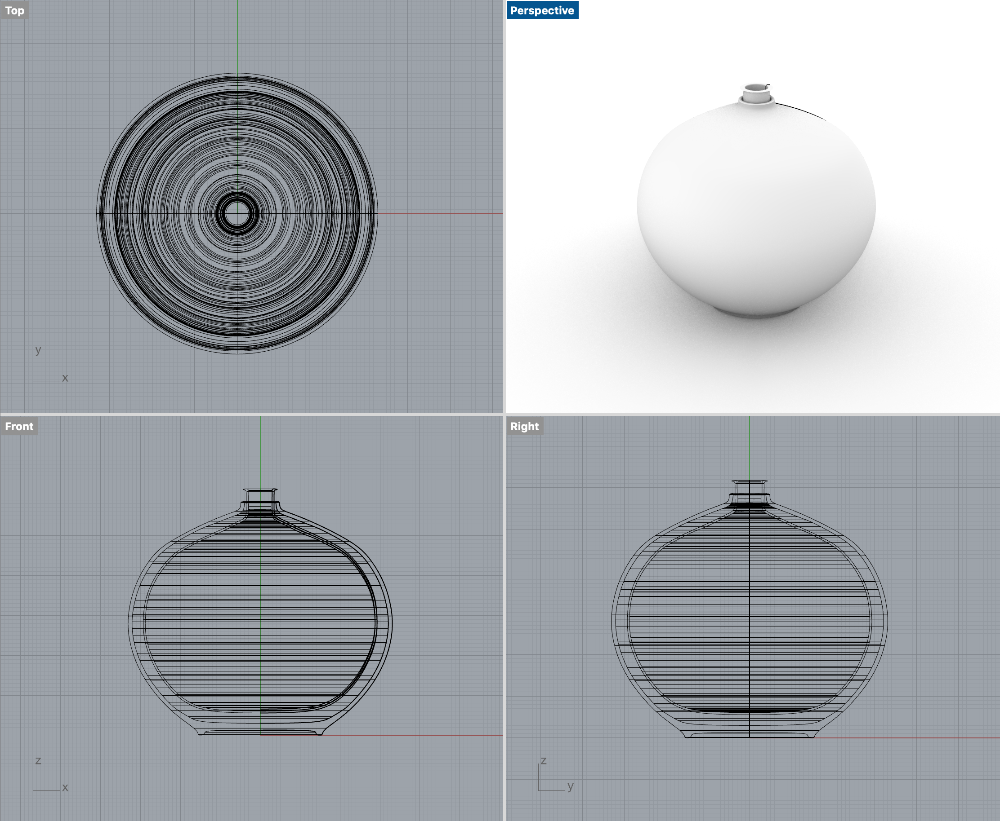

# ID1106 CAID Assignment 1

---

# Bauhaus Objects

---

## 01 Teapot

---

## 02 Cradle

---

## 03 Desk Lamp

---

## 04 Clock

---

# Revolve Objects

---

## 01 Vase

---

## 02 Cup

---

# Problems

- Had some trouble making the ears initially
  - Found out that I could use an ellipse then sweep1 around a circle to make the ears

---

## 03 Funnel

---

## 04 Round Wood Vase

---

## Problems

- I had trouble creating the rims

---

## 05 Skinny Black Vase

---

# Problems

- I had trouble creating the rims

---

# Thank you 😀
